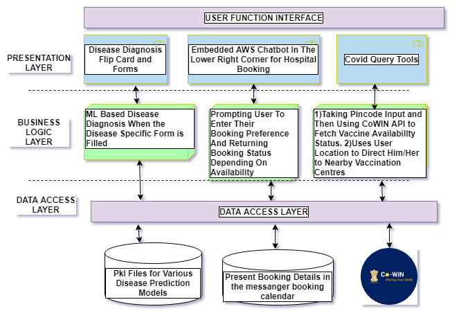
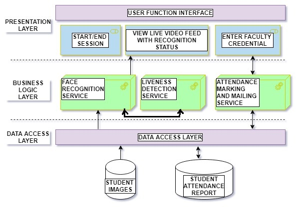

# Brief description about the private projects on my github account.Please contact me if you want to view the complete code.

## AiD | Integrated AI tool in shopping malls to aid advertising decisions

 - ### Brief Description: 
Big shopping malls are facing competition from e-commerce giants like Flipkart and
Amazon. We all know that our interactions with e-commerce applications are closely
monitored and this information is then further used for targeted marketing. These ecommerce portals are efficiently using the digital footprints left by their potential
customers to generate key insights and offer customized ads. But unfortunately, there
isn’t any mechanism in practice to capture these data in offline retail stores. Our proposed
application aims to solve this problem by smartly capturing important customer behavior
data, analyzing it, and then sharing it with the company to efficiently channel their
advertising budget.
This mini project is a small endeavor toward solving these issues. 

 - ### Following are some of the problems in the existing system:
1) A cumbersome manual customer feedback collection system, regarding a specific
product (in malls and retail stores) is not only time-consuming but also inefficient
in approach.
2) Since the traditional feedback collection approach involves hiring human
resources, large capital investment and human-made errors are inevitable.
3) Manually feeding the collected feedback for processing and generating insights is
again time taking.
4) Sometimes, to make quick advertising decisions, the current market demands of a
targeted gender/age group are required. But in most cases, these data analysis
processes are scheduled at the month-end.
5) All the above problems have been easily tackled by the e-commerce platforms
like Flipkart and Amazon and they are successfully using the collected data to
make appropriate business decisions. Consequently, consumer products are
supplied more on e-commerce platforms compared to physical retail stores and
malls. There is an absence of a robust system that captures, stores, and generates 
insights from the customers' interactions with the products in the shopping malls,
and sends periodically sends the insight report to the corresponding brand
representative.

 - ### Proposed Solution
Following are solutions to the above-stated problems:
1) A fully automated AI tool has been proposed that detects a human face, predicts,
and stores the probable Age group and Gender of the interested customer in the
database for further analysis.
2) Since this system is completely automated, the collected data is error-free and it
saves a huge amount of capital that used to be spent on human resource allocation.
3) Data collection and insight generation are very fast as these are automated
processes.
4) Live video feed (from all the connected cameras) with appropriately tagged Agegroup and gender, with real-time data plotting showing the percentage
contribution of the targeted group. This real-time data illustrating the interest of
the targeted group could be relied upon to make quick business decisions.
5) When the session is ended by the brand representative, and the current time and
weekday fall in the time frame and weekday allotted for that product, the brand
representative is prompted to sign in, and then the report is sent to his mail id.
6) When the password is entered and the authentication process is successful, a mail
consisting of the insight report is sent.

 - ### Tech-Stack: 
Python, OpenCV, DNN, MatPlotlib, FPDF, MySQL, Smtplib and various other libraries

 - ### Data Flow Diagram

 - ### Architecture Diagram

 - ### Demo ScreenShot

 - ### Detailed Report Documentation
   https://drive.google.com/file/d/1ecF_yRTiu-jM7_IQLd9Pc4CCGAuzf-5a/view?usp=drive_link

 - ### Certificate of Appreciation for Conference presentation in ICCPET 2022 

   

 - ### Project Demo (https://drive.google.com/file/d/1E1ZwyaI6gRRDPJaAFIcQ5jOcYLBEyqRi/view?usp=sharing )

## DocBot | ML based Disease Prediction and Hospital Booking WebApp
 - ### Brief Description:
We are living in an era where everyone is so busy with their work that they don’t have time to go through a periodic health check up in clinics.
As a result, we tend to ignore certain signs that our body is trying to give out which eventually turns out to be a deadly uncurable disease.
Apart from this, in India we have very few web platforms which helps us book appointment at multiple hospitals. Few Hospital like Apollo, Sevenhills hospitals have hospital specific booking system.
As of now we don’t have any web platform in india which offers both disease prediction and appointment booking.
Moreover, consulting a doctor by meeting him/her in person, has become even more difficult in this era of a pandemic. Like all other industries, even the digital health industry must cope up with these as soon as possible. 
 ### Objectives:
 1) Build a reliable Disease prediction Web app (apart from Diabetes also working on predicting Parkinson’s and onset of Tourette’s syndrome)
 2) Build Responsive UI
 3) Build AWS Lex based chatbot (integrated with Messanger) for smooth appointment booking experience.
 4) Build “one stop solution” to all covid related services using Web API

 - ### Tech-Stack
 HTML/CSS, Flask, Python, CoWIN API, AWS Lex, Heroku and various ML libraries for model preparation
 
 - ### Architecture Diagram

 - ### Detailed Report Documentation
   https://drive.google.com/file/d/16o_NY6UWeN5cYQnT09NOWkBDWrfoc9kk/view?usp=sharing
 - ### project demo (https://drive.google.com/file/d/14dP7q3WjSTDsgCJ-0KwNvdZ17U5qG7zw/view?usp=sharing )
 - ### visit the WebApp (http://docbot2021.herokuapp.com/).

## Face Recognition-Based Attendance Mailing System
The Face Recognition based Attendance (Slot basis) Mailing System is an automated service built to be used by the schools colleges and universities to solve a lot of problems which was not addressed by the previous Attendance System ( mainly Biometric based).  
In the pre-covid era, when the classes used to be held in physical classrooms, attendance used to be taken using biometric sensors located outside the classroom. Separate 10 minutes were allotted for this purpose only. Since it used to be located outside the classroom, even the absentees who were bunking the class could give biometric. It is not feasible for a faculty to make note of all the absentees when the class strength is high.
There are several colleges and schools which have already started doing physical classroom sessions keeping Covid protocol in consideration. But biometric based attendance system has created a challenge because it will increase the risk of spreading covid as all students of a class will be using same biometric machine.
This mini project is a small endeavour towards solving these issues. 

 - ### Following are some of the problems in the existing system:
1) Extra lecture time (10 minutes) wasted in registering attendance using a biometric sensorbased system.
2) Absentees being able to give attendance because the sensor is located outside the
classroom.
3) High Risk of spreading Covid if continued with the existing biometric based Attendance
System
4) (future problem) Students trying to give a proxy using friends' photos when they realise
face recognition based technology is being used.

 - ### PROPOSED SOLUTION
Following are solutions to the above-stated problems:
1) With the help of face recognition (camera facing towards the classroom), the detected
faces of the students in the live video feed will be taken and then matched with the faces
of the registered students.
2) The entire video feed will be visible to the faculty along with recognition status.
3) There are three possible recognition statuses that a live face will be tagged with. These
are “Name_of_student”, “Unknown”, “Name_of_student_fake”.
4) Upon successful recognition and liveness detection, their name, registration number, and
time-stamp are recorded in a csv file.
5) When the lecture time is over and the faculty ends the session, he/she is prompted to
enter the password of his/her registered mail.
6) The login credentials of only that faculty will be considered who is allotted for that
particular slot (day and time).
7) As soon as the password is entered, a mail consisting of the attendance report (csv file
consisting of present student details) is sent to his/her mail id.

 - ### Tech-Stack: 
Python, OpenCV, Dlib, Numpy, Smtplib and various other libraries

 - ### Architecture Diagram

### project demo ( )
### project documentation ( https://drive.google.com/file/d/1i92G5R2z-yPtwQFX5K2erMU-dQnmT5oH/view?usp=drive_link )

## Image Steganography using Python
Today steganography is mostly used on computers with digital data, like Image, Audio, Video, Network packets, etc, acting as the carriers. Images are an excellent medium for concealing information because they provide a high degree of redundancy - which means that there are lots of bits that are there to provide accuracy far greater than necessary for the object's use (or display). Steganography techniques exploit these redundant bits to hide the information/payload by altering them in such a way that alterations cannot be detected easily by humans or computers.
 - ### project documentation ( https://github.com/adityakishan2018/AboutPrivateProjects/blob/master/Hiding_and_reveal_algo.pdf )

